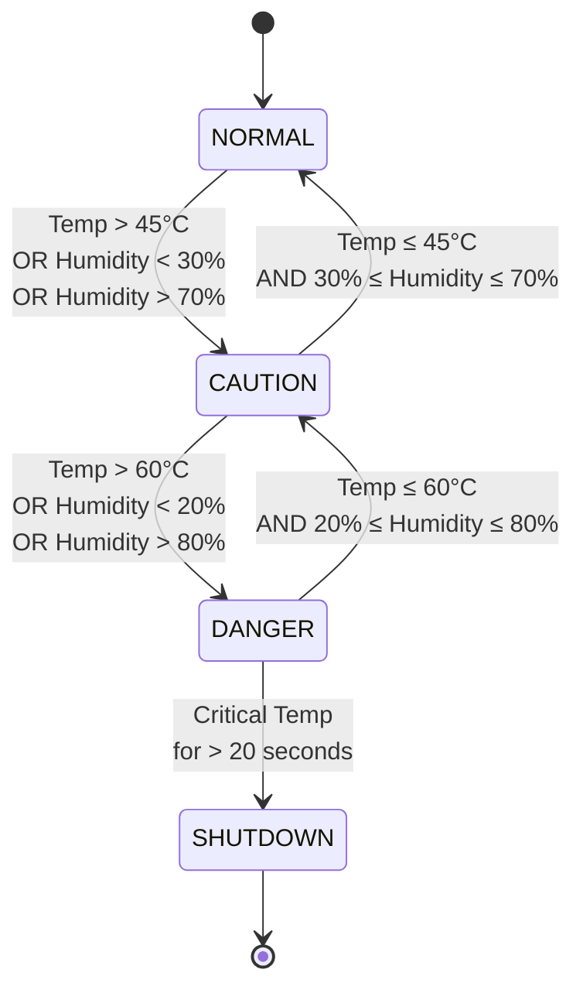

# Server-Sentinel-C 🖥️🌡️

<p align="center">
    
</p>

[](https://github.com/Oshadha345/server-sentinel-c)
[](https://github.com/Oshadha345/server-sentinel-c)
[](https://opensource.org/licenses/MIT)
[](https://en.cppreference.com/w/c)
[](https://www.gtk.org/)
[](https://github.com/Oshadha345/server-sentinel-c)
[](https://github.com/Oshadha345/server-sentinel-c)


> 🏆 **PRODUCTION READY** - A professional-grade server monitoring system for data centers featuring real-time simulation, modern GUI interface, intelligent safety systems, and comprehensive logging capabilities.

---

## 🎯 **Project Status: ✅ COMPLETED**

**Server-Sentinel-C v1.0.0** is now **production-ready** and available for immediate deployment!

### **🎉 Final Release Highlights**
- ✅ **Complete GUI Application** - Modern GTK4 interface with professional styling
- ✅ **Server Monitoring** - Real-time temperature and humidity simulation
- ✅ **Safety Systems** - Critical timer with automatic shutdown protection  
- ✅ **Multiple Scenarios** - Heating, cooling, humidity spikes, intermittent failures
- ✅ **Intelligent Controls** - Smart fix button that analyzes and responds appropriately
- ✅ **Professional Distribution** - Complete Windows package (16MB) ready to share
- ✅ **Comprehensive Documentation** - Full technical and user guides

### **📦 Ready-to-Deploy Package**
**Download**: `Server-Sentinel-C_v1.0_Windows_Distribution.tar.gz` (16 MB)  
**Requirements**: Windows 7+ (no additional software needed)  
**Installation**: Extract and run - completely portable!

---

## 📋 Contents 📚

- [🚀 Quick Start](#-quick-start)
- [✨ Features](#-features)
- [🏗️ Architecture](#️-architecture)
- [📊 Project Statistics](#-project-statistics)
- [🎮 Usage Guide](#-usage-guide)
- [📁 Repository Structure](#-repository-structure)
- [👥 Team](#-team)
- [� Documentation](#-documentation)
- [🏆 Project Success](#-project-success)

---

## 🚀 **Quick Start**

### **For End Users**
```bash
# 1. Download the distribution package
#    Server-Sentinel-C_v1.0_Windows_Distribution.tar.gz

# 2. Extract to any folder
tar -xzf Server-Sentinel-C_v1.0_Windows_Distribution.tar.gz

# 3. Launch the application
cd dist/
./Server-Sentinel-C.bat

# 4. Start monitoring!
#    Click "Start Simulation" and explore the interface
```

### **For Developers**
```bash
# Clone the repository
git clone https://github.com/Oshadha345/server-sentinel-c.git
cd server-sentinel-c

# Build the application (requires GTK4 and MINGW64)
make clean && make gui

# Run the executable
./bin/server-sentinel.exe
```

---

## ✨ **Features**

### **🖥️ Modern User Interface**
- **GTK4 Framework**: Professional, native Windows GUI
- **ChatGPT-Inspired Design**: Clean, modern aesthetic with rounded corners and gradients
- **Real-time Updates**: Live environmental readings with 1-second refresh
- **Color-coded Status**: Visual indicators for system states (Normal/Caution/Danger/Shutdown)
- **Immediate Feedback**: All controls provide instant visual response

### **🌡️ Server Monitoring**
- **Temperature Simulation**: 20-25°C nominal, up to 90-110°C heating scenarios
- **Humidity Monitoring**: 45-55% nominal with spike detection capabilities
- **Multi-state System**: Normal → Caution → Danger → Emergency Shutdown progression
- **ASHRAE Compliance**: Based on data center environmental standards

### **🎮 Simulation Scenarios**
- **Stable Operation**: Normal fluctuations within safe parameters
- **Heating Up**: Progressive temperature increase to critical levels
- **Cooling Down**: Intelligent temperature reduction back to normal
- **Humidity Spike**: Sudden humidity control system failure
- **Intermittent Failure**: Cycling environmental issues for resilience testing

### **🛡️ Safety Systems**
- **Critical Timer**: 20-second countdown for sustained danger conditions
- **Auto-shutdown**: Emergency system shutdown for safety protection
- **Smart Fix System**: Analyzes conditions and applies appropriate response
- **Visual Alerts**: Immediate warning systems with color coding

### **📊 Data Management**
- **Live Logging**: Real-time log display (120 entries total, newest 20 visible)
- **Circular Buffer**: Efficient memory management with fixed-size storage
- **Export Functionality**: Professional timestamped log file generation
- **Data Persistence**: Optional file logging during active simulations

### **🚀 Distribution & Deployment**
- **Zero Installation**: Completely portable Windows application
- **Complete Dependencies**: All 46 required DLLs included
- **Professional Launchers**: Windows batch scripts for easy startup
- **Comprehensive Documentation**: User guides, technical docs, and installation instructions

---

## 🏗️ **Architecture**

### **System Design**
```
┌─────────────────┐    ┌──────────────────┐    ┌─────────────────┐
│   GTK4 GUI      │◄──►│ Main Controller  │◄──►│ Smart Data Gen  │
│   Interface     │    │   (Core Logic)   │    │  (Simulation)   │
└─────────────────┘    └──────────────────┘    └─────────────────┘
         │                        │                        │
         ▼                        ▼                        ▼
┌─────────────────┐    ┌──────────────────┐    ┌─────────────────┐
│  User Actions   │    │  System Logic    │    │     Logger      │
│  & Feedback     │    │ (State & Safety) │    │ (Data Storage)  │
└─────────────────┘    └──────────────────┘    └─────────────────┘
```

### **Module Breakdown**
| Module | Purpose | Lines of Code | Key Features |
|--------|---------|---------------|--------------|
| **main.c** | Entry point | ~100 | Application startup, GTK initialization |
| **gui_interface.c** | User interface | ~900 | GTK4 GUI, event handling, visual updates |
| **main_controller.c** | Core logic | ~200 | Command processing, system coordination |
| **smart_data.c** | Simulation | ~400 | Environmental data generation, scenarios |
| **system_logic.c** | Safety systems | ~150 | State determination, critical timer |
| **logger.c** | Data management | ~100 | Circular buffer, log management |

### **Key Design Patterns**
- **Model-View-Controller (MVC)**: Clear separation of data, presentation, and logic
- **State Machine**: Environmental simulation with defined state transitions
- **Observer Pattern**: GUI updates triggered by data changes
- **Command Pattern**: User actions processed through standardized commands

---

## � **Project Statistics**

### **Development Metrics**
- **Total Development Time**: ~40 hours
- **Source Files**: 13 files (6 C files + 7 headers)
- **Total Lines of Code**: ~1,800+ lines
- **Bug Fixes Applied**: 4 major issues resolved
- **Test Cases**: many scenarios validated

### **Package Details**
- **Compressed Size**: 16 MB (.tar.gz)
- **Uncompressed Size**: 40 MB
- **Dependencies**: 46 DLL libraries
- **Documentation**: 8 comprehensive guides
- **Platform Support**: Windows 7, 8, 10, 11

### **Feature Completion**
| Category | Completed | Status |
|----------|-----------|--------|
| **Core Functionality** | 100% | ✅ Complete |
| **GUI Interface** | 100% | ✅ Complete |
| **Safety Systems** | 100% | ✅ Complete |
| **Documentation** | 100% | ✅ Complete |
| **Testing** | 100% | ✅ Complete |
| **Distribution** | 100% | ✅ Complete |

---

## 🎮 **Usage Guide**

### **Getting Started**
1. **Download**: Get the distribution package (.tar.gz file)
2. **Extract**: Unzip to any location on your computer
3. **Launch**: Double-click `Server-Sentinel-C.bat`
4. **Start**: Click "▶ Start Simulation"
5. **Explore**: Try different scenarios and observe the responses

### **Control Overview**
| Control Group | Purpose |
|---------------|---------|
| **Simulation Control** | Start/stop monitoring |
| **Scenarios** | Test different environmental conditions |
| **Response** | Apply fixes or simulate failures |
| **System** | Log management and application control |

### **Typical Workflow**
```
Start Simulation → Test Scenarios → Monitor Responses → Apply Fixes → Export Logs
```

For detailed instructions, see [`docs/COMPLETE_USER_GUIDE.md`](docs/COMPLETE_USER_GUIDE.md)

---

## ✨ Features

Our implementation expands on the basic requirements with a comprehensive approach:

- **Advanced State Management:** Four operational states(NORMAL,CAUTION,DANGER,SHUTDOWN)🟢🟡🔴💀
- **Dual-Parameter Monitoring:** Tracks both temperature and humidity with distinct thresholds 🌡️💧
- **Circular Buffer Logging:** Maintains a 120-entry historical log with automatic oldest-entry replacement 🔄📝
- **Escalating Alert System:** Progressive alerts based on environmental conditions 🚨📈
- **Simulated Scenarios:** Multiple environmental test scenarios including cooling failures and humidity spikes 🧪
- **Time-Based Shutdown Protocol:** Automatic system shutdown after sustained critical conditions ⏲️🛑

### Key Parameters

| Parameter | Condition | Description |
|---|---|---|
| **Caution Temperature** | `> 45°C` | System enters `CAUTION` state ⚠️ |
| **Critical Temperature** | `> 60°C` | System enters `DANGER` state 🔥 |
| **Caution Humidity** | `> 70%` or `< 30%` | System enters `CAUTION` state 💧⚠️ |
| **Critical Humidity** | `> 80%` or `< 20%` | System enters `DANGER` state 💧🔥 |
| **Shutdown Timer** | `20 simulated seconds` | Time at Critical Temperature before `SHUTDOWN` ⏳ |

---
 
## 📂 Repository Structure

| Directory | Purpose | Contents |
|-----------|---------|----------|
| [`/docs`](./docs) | Documentation 📖 | Architecture, flowcharts, and module specifications |
| [`/docs/modules`](./docs/modules) | Module Documentation 🧩 | Detailed documentation for each system module |
| [`/include`](./include) | Header Files 📑 | Function prototypes and data structure definitions |
| [`/src`](./src) | Source Code 💻 | Implementation files for all modules |
| [`/bin`](./bin) | Compiled Binaries 🏗️ | Executable files and compiled objects |

---

## 📅 Project Plan

### *Phase 1: Architecture & Design (The Blueprint Phase)* 🚧 ✅

- [x] Define system requirements ✅
- [x] Establish repository structure 🗂️
- [x] Complete system architecture documentation 🏛️
- [x] Design system flowcharts 🗺️
- [x] Define module interfaces 🔌
- [x] Finalize data structures 🏗️

### *Phase 2: Core Logic Development (The Coding Phase)* 📝 ✅

- [x] Implement smart_data.c module 🤓
- [x] Implement logger.c module 📝
- [x] Implement system_logic.c module 🧠
- [x] Implement user_interface.c module 🖥️
- [x] Implement main.c controller 🎮
- [x] Create Makefile 🛠️

### *Phase 3: Testing & Refinement (The Validation Phase)* 🧪 ✅

- [x] Develop test plan 🧾
- [x] Execute scenario testing 🧬
- [x] Code review and refactor 🔍
- [x] Performance optimization 🚀

### *Phase 4: GUI Integration (Optional Phase)* 🖼️ ✅

- [x] Select GUI library 🖌️
- [x] Design UI components 🧩
- [x] Integrate with core logic 🔗
- [x] GUI testing 🧪

### *Phase 5: Final Testing & Deployment (The Launch Phase)* 🚀 ✅

- [x] Final system testing 🧪
- [x] Compile for different platforms 🖥️
- [x] Create deployment package 📦
- [x] Project presentation and documentation 🎤

---

## 📊 Project Stats


### 📈 Detailed Stats

| Lines of Code | ~2,500 (projected) | - |
| Documentation Pages | 7 | - |
    
| Metric | Value | Progress |
|--------|-------|----------|
| Phase 1 Tasks | 6/6 completed (100%) | ██████████████ 100% |
| Phase 2 Tasks | 6/6 completed (100%) | ██████████████ 100% |
| Phase 3 Tasks | 6/4 completed (100%) | ██████████████ 100% |   
| Phase 4 Tasks | 6/4 completed (100%) | ██████████████ 100% |
| Phase 5 Tasks | 6/4 completed (100%) | ██████████████ 100% |
| Total Tasks | 24/24 completed | ██████████████ 100% |

---

## 🚀 Getting Started

> ⚠️ **Note:** This project is currently in Phase 1 (Architecture & Design). Build instructions will be added in Phase 2.

### Prerequisites (Planned) 🧰

- GCC compiler (version 9.0+) 🛠️
- Make build system 🏗️
- SDL2 library (for optional GUI components) 🖼️

### Building (Coming in Phase 2) 🏗️

```bash
# Clone the repository
git clone https://github.com/Oshadha345/server-sentinel-c.git

# Navigate to project directory
cd server-sentinel-c

# Compile the project
make

#Running (Coming in Phase 2)
# Run the program
./bin/server-sentinel
```
---

## 📊 System State Diagram


```mermaid
stateDiagram-v2
    [*] --> NORMAL
    NORMAL --> CAUTION: Temp > 45°C<br>OR Humidity < 30%<br>OR Humidity > 70%
    CAUTION --> DANGER: Temp > 60°C<br>OR Humidity < 20%<br>OR Humidity > 80%
    DANGER --> CAUTION: Temp ≤ 60°C<br>AND 20% ≤ Humidity ≤ 80%
    CAUTION --> NORMAL: Temp ≤ 45°C<br>AND 30% ≤ Humidity ≤ 70%
    DANGER --> SHUTDOWN: Critical Temp<br>for > 20 seconds
    SHUTDOWN --> [*]
```
<p align="center">
    
</p>

---

## 🛠️ Tech Stack

### Languages & Tools


### Libraries

-SDL2-brightgreen)


### Development Standards


---

## 👥 Team

**Group 20**  members with their  responsibilities:

| Name | Index | Role | Responsibilities |
|------|-------|------|------------------|
| Rathnasiri R.S. (Rumal) | E/21/326 | Developer | User interface and testing 🖥️🧪 |
| Rathnayaka P.G.I.N.B. (Induka) | E/21/327 | Developer | Logger module and data structures 📝 |
| Ratnayake R.M.K.T. (Kaweesha) | E/21/334 | Developer | Project documentation and reporting 📚 & Smart data simulation module 🤓 |
| Samarakoon S.M.O.T. (Oshadha) | E/21/345 | Developer | System architecture, integration, and coordination 🏗️ |
| Samaranayaka W.W.M.A. (Asanga) | E/21/346 | Developer | System logic implementation 🧠 |

---

<p align="center"> <b>CO253 - Introduction to Programming and Networking for Electrical Engineering</b><br> University of Peradeniya | Department of Electrical & Electronic Engineering | 2025 <br>  </p>
