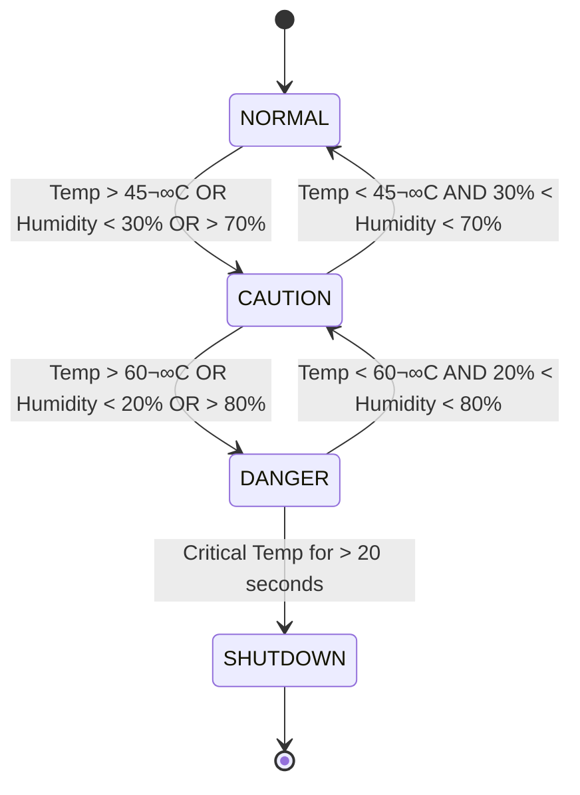

# Server-Sentinel-C 🖥️🌡️

<p align="center">
  
</p>

[](https://github.com/yourusername/server-sentinel-c)
[](https://github.com/yourusername/server-sentinel-c)
[](https://opensource.org/licenses/MIT)
[](https://en.cppreference.com/w/c)
[](https://github.com/yourusername/server-sentinel-c)

> A C-based simulation of a mission-critical environmental controller for data centers, featuring a state-driven design, escalating alerts, and an emergency shutdown protocol based on ASHRAE standards.

---

## 📋 Contents

- [Project Brief](#-project-brief)
- [Features](#-features)
- [Repository Structure](#-repository-structure)
- [Team](#-team)
- [Project Plan](#-project-plan)
- [Getting Started](#-getting-started)

---

## 📑 Project Brief

### CO253 - Introduction to Programming and Networking for Electrical Engineering

🌟 **Project Objective**  
Students will develop software-only simulations of embedded systems using the C programming language. This is a foundational exercise intended to simulate real-world behavior of embedded devices while focusing on clean coding practices and logical system design. Graphical features are optional and may be developed using SDL or any cross-platform GUI library.

📅 **Project Allocation**  
Each group has been assigned a unique project with custom parameters.

**Project Description**  
Temperature Logger – Monitors and logs temperature values and provides alerts.

**Group 20:**
- Project: Temp/Humidity Logger
- Alert Threshold: 60
- Log Size: 120

---

## ✨ Features

Our implementation expands on the basic requirements with a comprehensive approach:

- **Advanced State Management:** Four distinct operational states (NORMAL, CAUTION, DANGER, SHUTDOWN)
- **Dual-Parameter Monitoring:** Tracks both temperature and humidity with distinct thresholds
- **Circular Buffer Logging:** Maintains a 120-entry historical log with automatic oldest-entry replacement
- **Escalating Alert System:** Progressive alerts based on environmental conditions
- **Simulated Scenarios:** Multiple environmental test scenarios including cooling failures and humidity spikes
- **Time-Based Shutdown Protocol:** Automatic system shutdown after sustained critical conditions

### Key Parameters

| Parameter | Condition | Description |
|-----------|-----------|-------------|
| Caution Temperature | > 45°C | System enters CAUTION state |
| Critical Temperature | > 60°C | System enters DANGER state |
| Caution Humidity | > 70% or < 30% | System enters CAUTION state |
| Critical Humidity | > 80% or < 20% | System enters DANGER state |
| Shutdown Timer | 20 simulated seconds | Time at Critical Temperature before SHUTDOWN |

---
 
## 📂 Repository Structure

| Directory | Purpose | Contents |
|-----------|---------|----------|
| [`/docs`](./docs) | Documentation | Architecture, flowcharts, and module specifications |
| [`/docs/modules`](./docs/modules) | Module Documentation | Detailed documentation for each system module |
| [`/include`](./include) | Header Files | Function prototypes and data structure definitions |
| [`/src`](./src) | Source Code | Implementation files for all modules |
| [`/bin`](./bin) | Compiled Binaries | Executable files and compiled objects |


---

## 👥 Team

**Group 20**  members with their  responsibilities:

| Name | Index | Role | Responsibilities |
|------|-------|------|------------------|
| Prasad V.G.A. (Asitha) | E/21/313 | Developer | Smart data simulation module |
| Rathnasiri R.S. (Rumal) | E/21/326 | Developer | User interface and testing |
| Rathnayaka P.G.I.N.B. (Induka) | E/21/327 | Developer | Logger module and data structures |
| Ratnayake R.M.K.T. (Kaweesha) | E/21/334 | Developer | Project documentation and reporting |
| Samarakoon S.M.O.T. (Oshadha) | E/21/345 | Developer | System architecture, integration, and coordination |
| Samaranayaka W.W.M.A. (Asanga) | E/21/346 | Developer | System logic implementation |

---


## 📅 Project Plan

### *Phase 1: Architecture & Design (The Blueprint Phase)* 🚧

- [x] Define system requirements
- [x] Establish repository structure
- [ ] Complete system architecture documentation
- [ ] Design system flowcharts
- [ ] Define module interfaces
- [ ] Finalize data structures

### *Phase 2: Core Logic Development (The Coding Phase)* 📝

- [ ] Implement smart_data.c module
- [ ] Implement logger.c module
- [ ] Implement system_logic.c module
- [ ] Implement user_interface.c module
- [ ] Implement main.c controller
- [ ] Create Makefile

### *Phase 3: Testing & Refinement (The Validation Phase)* 🧪

- [ ] Develop test plan
- [ ] Execute scenario testing
- [ ] Code review and refactor
- [ ] Performance optimization

### *Phase 4: GUI Integration (Optional Phase)* 🖼️

- [ ] Select GUI library
- [ ] Design UI components
- [ ] Integrate with core logic
- [ ] GUI testing

### *Phase 5: Final Testing & Deployment (The Launch Phase)* 🚀

- [ ] Final system testing
- [ ] Compile for different platforms
- [ ] Create deployment package
- [ ] Project presentation and documentation

---

## 📊 Project Stats


<details>
  <summary>📈 Detailed Stats</summary>
  
  | Metric | Value | Progress |
  |--------|-------|----------|
  | Lines of Code | ~2,500 (projected) | - |
  | Documentation Pages | 7 | - |
  | Phase 1 Tasks | 2/6 completed (33%) | █████░░░░░░░░░ 33% |
  | Phase 2 Tasks | 0/6 completed (0%) | ░░░░░░░░░░░░░░ 0% |
  | Phase 3 Tasks | 0/4 completed (0%) | ░░░░░░░░░░░░░░ 0% |
  | Phase 4 Tasks | 0/4 completed (0%) | ░░░░░░░░░░░░░░ 0% |
  | Phase 5 Tasks | 0/4 completed (0%) | ░░░░░░░░░░░░░░ 0% |
  | Total Tasks | 2/24 completed | █░░░░░░░░░░░░░░ 8% |
  
  ### Phase Completion Visual
  
  ```mermaid
  pie title Project Phase Completion
      "Phase 1" : 33
      "Phase 2" : 0
      "Phase 3" : 0
      "Phase 4" : 0
      "Phase 5" : 0
      "Remaining" : 67
    </details> ```

---

## 🚀 Getting Started

> ⚠️ **Note:** This project is currently in Phase 1 (Architecture & Design). Build instructions will be added in Phase 2.

### Prerequisites (Planned)

- GCC compiler (version 9.0+)
- Make build system
- SDL2 library (for optional GUI components)

### Building (Coming in Phase 2)

```bash
# Clone the repository
git clone https://github.com/yourusername/server-sentinel-c.git

# Navigate to project directory
cd server-sentinel-c

# Compile the project
make

#Running (Coming in Phase 2)
# Run the program
./bin/server-sentinel
```
---

## 📊 System State Diagram


---
<p align="center"> <b>CO253 - Introduction to Programming and Networking for Electrical Engineering</b><br> University of Peradeniya | Department of Electrical & Electronic Engineering | 2025 </p>
