# Server-Sentinel-C 🖥️🌡️

<p align="center">
    
</p>

[](https://github.com/Oshadha345/server-sentinel-c)
[](https://github.com/Oshadha345/server-sentinel-c)
[](https://opensource.org/licenses/MIT)
[](https://en.cppreference.com/w/c)
[](https://github.com/Oshadha345/server-sentinel-c)


> A C-based simulation of a mission-critical environmental controller for data centers, featuring a state-driven design, escalating alerts, and an emergency shutdown protocol based on ASHRAE standards.

---

## 📋 Contents 📚

- [Project Brief](#-project-brief) 📝
- [Features](#-features) ✨
- [Repository Structure](#-repository-structure) 🗂️
- [Team](#-team) 👥
- [Project Plan](#-project-plan) 🗓️
- [Getting Started](#-getting-started) 🚀

---

## 📑 Project Brief

### CO253 - Introduction to Programming and Networking for Electrical Engineering

🌟 **Project Objective**  
Students will develop software-only simulations of embedded systems using the C programming language. This is a foundational exercise intended to simulate real-world behavior of embedded devices while focusing on clean coding practices and logical system design. Graphical features are optional and may be developed using SDL or any cross-platform GUI library.

📅 **Project Allocation**  
Our group has been assigned with following project along with custom parameters.

**Project Description**  
Temperature Logger – Monitors and logs temperature values and provides alerts.

**Group 20:**
- Project: Temp/Humidity Logger
- Alert Threshold: 60
- Log Size: 120

---

## ✨ Features

Our implementation expands on the basic requirements with a comprehensive approach:

- **Advanced State Management:** Four operational states(NORMAL,CAUTION,DANGER,SHUTDOWN)🟢🟡🔴💀
- **Dual-Parameter Monitoring:** Tracks both temperature and humidity with distinct thresholds 🌡️💧
- **Circular Buffer Logging:** Maintains a 120-entry historical log with automatic oldest-entry replacement 🔄📝
- **Escalating Alert System:** Progressive alerts based on environmental conditions 🚨📈
- **Simulated Scenarios:** Multiple environmental test scenarios including cooling failures and humidity spikes 🧪
- **Time-Based Shutdown Protocol:** Automatic system shutdown after sustained critical conditions ⏲️🛑

### Key Parameters

| Parameter | Condition | Description |
|---|---|---|
| **Caution Temperature** | `> 45°C` | System enters `CAUTION` state ⚠️ |
| **Critical Temperature** | `> 60°C` | System enters `DANGER` state 🔥 |
| **Caution Humidity** | `> 70%` or `< 30%` | System enters `CAUTION` state 💧⚠️ |
| **Critical Humidity** | `> 80%` or `< 20%` | System enters `DANGER` state 💧🔥 |
| **Shutdown Timer** | `20 simulated seconds` | Time at Critical Temperature before `SHUTDOWN` ⏳ |

---
 
## 📂 Repository Structure

| Directory | Purpose | Contents |
|-----------|---------|----------|
| [`/docs`](./docs) | Documentation 📖 | Architecture, flowcharts, and module specifications |
| [`/docs/modules`](./docs/modules) | Module Documentation 🧩 | Detailed documentation for each system module |
| [`/include`](./include) | Header Files 📑 | Function prototypes and data structure definitions |
| [`/src`](./src) | Source Code 💻 | Implementation files for all modules |
| [`/bin`](./bin) | Compiled Binaries 🏗️ | Executable files and compiled objects |

---

## 📅 Project Plan

### *Phase 1: Architecture & Design (The Blueprint Phase)* 🚧

- [x] Define system requirements ✅
- [x] Establish repository structure 🗂️
- [x] Complete system architecture documentation 🏛️
- [x] Design system flowcharts 🗺️
- [x] Define module interfaces 🔌
- [ ] Finalize data structures 🏗️

### *Phase 2: Core Logic Development (The Coding Phase)* 📝

- [ ] Implement smart_data.c module 🤓
- [ ] Implement logger.c module 📝
- [ ] Implement system_logic.c module 🧠
- [ ] Implement user_interface.c module 🖥️
- [ ] Implement main.c controller 🎮
- [ ] Create Makefile 🛠️

### *Phase 3: Testing & Refinement (The Validation Phase)* 🧪

- [ ] Develop test plan 🧾
- [ ] Execute scenario testing 🧬
- [ ] Code review and refactor 🔍
- [ ] Performance optimization 🚀

### *Phase 4: GUI Integration (Optional Phase)* 🖼️

- [ ] Select GUI library 🖌️
- [ ] Design UI components 🧩
- [ ] Integrate with core logic 🔗
- [ ] GUI testing 🧪

### *Phase 5: Final Testing & Deployment (The Launch Phase)* 🚀

- [ ] Final system testing 🧪
- [ ] Compile for different platforms 🖥️
- [ ] Create deployment package 📦
- [ ] Project presentation and documentation 🎤

---

## 📊 Project Stats


### 📈 Detailed Stats

| Lines of Code | ~2,500 (projected) | - |
| Documentation Pages | 7 | - |
    
| Metric | Value | Progress |
|--------|-------|----------|
| Phase 1 Tasks | 5/6 completed (83%) | ███████████░░ 83% |
| Phase 2 Tasks | 0/6 completed (0%) | ░░░░░░░░░░░░░░ 0% |
| Phase 3 Tasks | 0/4 completed (0%) | ░░░░░░░░░░░░░░ 0% |   
| Phase 4 Tasks | 0/4 completed (0%) | ░░░░░░░░░░░░░░ 0% |
| Phase 5 Tasks | 0/4 completed (0%) | ░░░░░░░░░░░░░░ 0% |
| Total Tasks | 5/24 completed | ███░░░░░░░░░░░░ 21% |

---

## 🚀 Getting Started

> ⚠️ **Note:** This project is currently in Phase 1 (Architecture & Design). Build instructions will be added in Phase 2.

### Prerequisites (Planned) 🧰

- GCC compiler (version 9.0+) 🛠️
- Make build system 🏗️
- SDL2 library (for optional GUI components) 🖼️

### Building (Coming in Phase 2) 🏗️

```bash
# Clone the repository
git clone https://github.com/Oshadha345/server-sentinel-c.git

# Navigate to project directory
cd server-sentinel-c

# Compile the project
make

#Running (Coming in Phase 2)
# Run the program
./bin/server-sentinel
```
---

## 📊 System State Diagram

```mermaid
stateDiagram-v2
    [*] --> NORMAL
    NORMAL --> CAUTION: Temp > 45°C<br>OR Humidity < 30%<br>OR Humidity > 70%
    CAUTION --> DANGER: Temp > 60°C<br>OR Humidity < 20%<br>OR Humidity > 80%
    DANGER --> CAUTION: Temp ≤ 60°C<br>AND 20% ≤ Humidity ≤ 80%
    CAUTION --> NORMAL: Temp ≤ 45°C<br>AND 30% ≤ Humidity ≤ 70%
    DANGER --> SHUTDOWN: Critical Temp<br>for > 20 seconds
    SHUTDOWN --> [*]
```


<p align="center">
    
</p>

---

## 🛠️ Tech Stack

### Languages & Tools


### Libraries

-SDL2-brightgreen)


### Development Standards


---

## 👥 Team

**Group 20**  members with their  responsibilities:

| Name | Index | Role | Responsibilities |
|------|-------|------|------------------|
| Prasad V.G.A. (Asitha) | E/21/313 | Developer | Smart data simulation module 🤓 |
| Rathnasiri R.S. (Rumal) | E/21/326 | Developer | User interface and testing 🖥️🧪 |
| Rathnayaka P.G.I.N.B. (Induka) | E/21/327 | Developer | Logger module and data structures 📝 |
| Ratnayake R.M.K.T. (Kaweesha) | E/21/334 | Developer | Project documentation and reporting 📚 |
| Samarakoon S.M.O.T. (Oshadha) | E/21/345 | Developer | System architecture, integration, and coordination 🏗️ |
| Samaranayaka W.W.M.A. (Asanga) | E/21/346 | Developer | System logic implementation 🧠 |

---

<p align="center"> <b>CO253 - Introduction to Programming and Networking for Electrical Engineering</b><br> University of Peradeniya | Department of Electrical & Electronic Engineering | 2025 <br>  </p>
