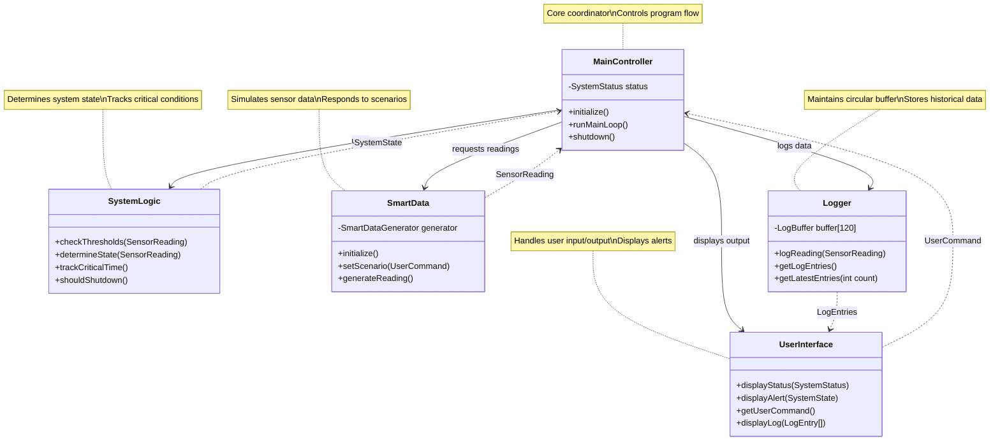

# System Architecture

## Overview
The Server-Sentinel-C system is designed as a modular, state-driven application that simulates a mission-critical environmental controller for data centers. The system follows the Single Responsibility Principle, with each module having a clearly defined role.

## Modules

### 1. Main Controller
- **Purpose**: Manages the main application loop and system state
- **Responsibilities**:
  - Initialize all subsystems
  - Maintain the main program loop
  - Coordinate between other modules

### 2. System Logic
- **Purpose**: Contains the core logic for threshold checking and state transitions
- **Responsibilities**:
  - Compare sensor readings against thresholds
  - Manage system state transitions (NORMAL, CAUTION, DANGER, SHUTDOWN)
  - Track time spent in critical states

### 3. Smart Data
- **Purpose**: Generate simulated environmental data
- **Responsibilities**:
  - Simulate various environmental scenarios (normal, cooling failure, etc.)
  - Produce realistic temperature and humidity readings
  - Respond to user commands to change environmental conditions

### 4. Logger
- **Purpose**: Manage the 120-entry circular log buffer
- **Responsibilities**:
  - Record all sensor readings
  - Maintain circular buffer when maximum capacity is reached
  - Provide access to historical data

### 5. User Interface
- **Purpose**: Handle console input/output
- **Responsibilities**:
  - Process user commands
  - Display system status and alerts
  - Present log data in a readable format

## Data Structures

### Key Enumerations
- `SystemState`: NORMAL, CAUTION, DANGER, SHUTDOWN
- `MockDataState`: STABLE, HEATING_UP, COOLING_DOWN, HUMIDITY_SPIKE, INTERMITTENT_FAILURE

### Key Structures
- `SensorReading`: Contains temperature and humidity values
- `LogEntry`: Contains a sensor reading and a timestamp
- `SmartDataGenerator`: Make smart data generation stateful, including current temperature, humidity, and drift values
- `LogBuffer`: Circular buffer of LogEntries
- `UserCommand`: Represents user commands to change system state or data generation
- `SystemStatus`: Contains current system state, last reading, and log buffer
- `Controller`: Main controller that initializes and manages the system

## Module Interactions
- Main Controller initializes all modules and manages the program flow
- Smart Data generates readings that are passed to the System Logic
- System Logic determines the system state based on readings
- Logger records all readings regardless of system state
- User Interface processes commands that influence the Smart Data module

## System Architecture Diagram

