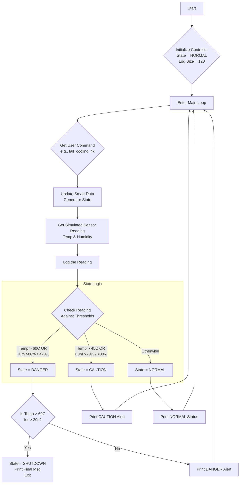
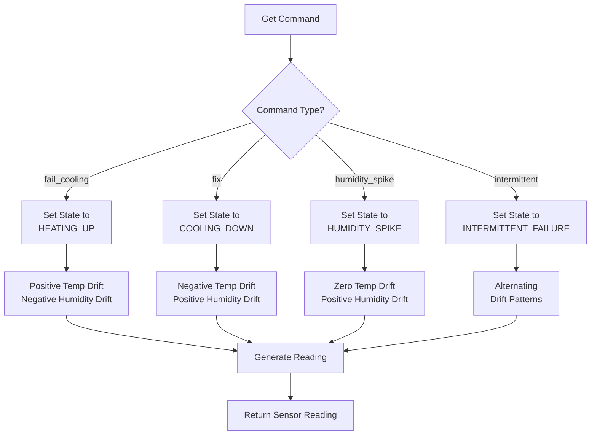
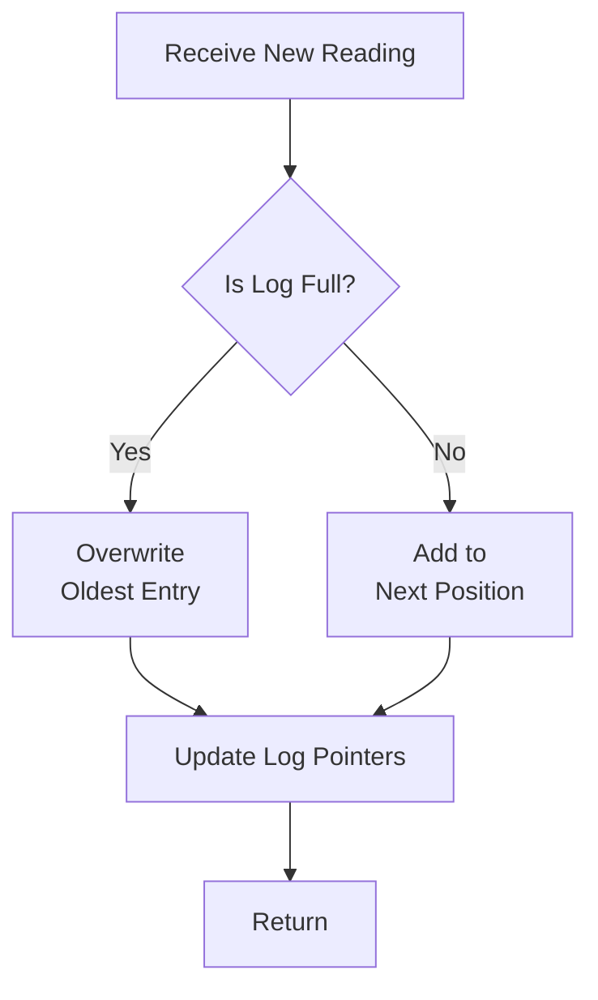
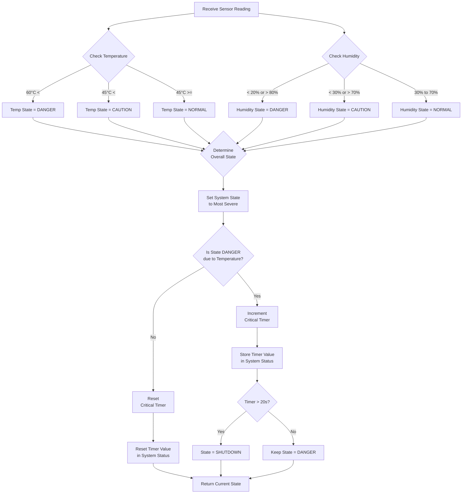

# 📊 System Flowchart

---

## 🚀 Main System Flow

> The following flowchart represents the core logic of the **Server-Sentinel-C** system:

---

## 🧠 Smart Data Module Flow

> The following flowchart shows how the **Smart Data** module processes commands and generates sensor readings:

---

## 📝 Logger Module Flow

> The following flowchart illustrates the circular buffer mechanism of the **Logger** module:

---

## 💡 System Logic Module Flow

---

    

