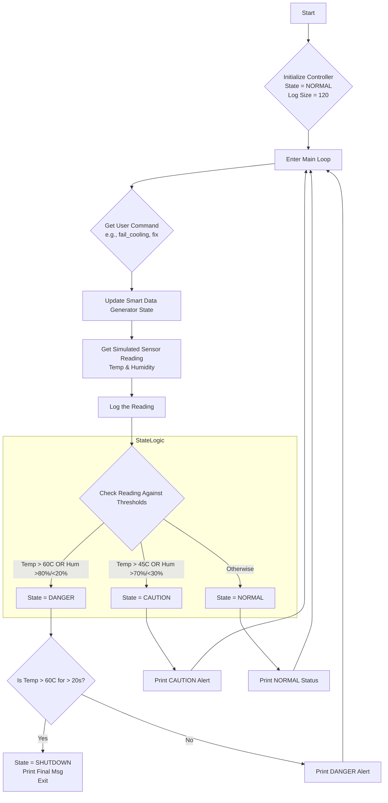

# System Flowchart

## Main System Flow

The following flowchart represents the core logic of the Server-Sentinel-C system:

```mermaid
graph TD
    A1[Start] --> B1{Initialize Controller<br>State = NORMAL<br>Log Size = 120}
    B1 --> C1[Enter Main Loop]
    C1 --> D1{Get User Command<br>e.g., fail_cooling, fix}
    D1 --> E1[Update Smart Data Generator State]
    E1 --> F1[Get Simulated Sensor Reading<br>Temp & Humidity]
    F1 --> G1[Log the Reading]
    G1 --> H1{Check Reading Against Thresholds}
    
    subgraph StateLogic
        H1 -- Temp > 60C OR Hum >80%/<20% --> I1[State = DANGER]
        H1 -- Temp > 45C OR Hum >70%/<30% --> J1[State = CAUTION]
        H1 -- Otherwise --> K1[State = NORMAL]
    end

    I1 --> L1{Is Temp > 60C for > 20s?}
    L1 -- Yes --> M1[State = SHUTDOWN<br>Print Final Msg<br>Exit]
    L1 -- No --> N1[Print DANGER Alert]
    
    J1 --> O1[Print CAUTION Alert]
    K1 --> P1[Print NORMAL Status]

    N1 --> C1
    O1 --> C1
    P1 --> C1
```